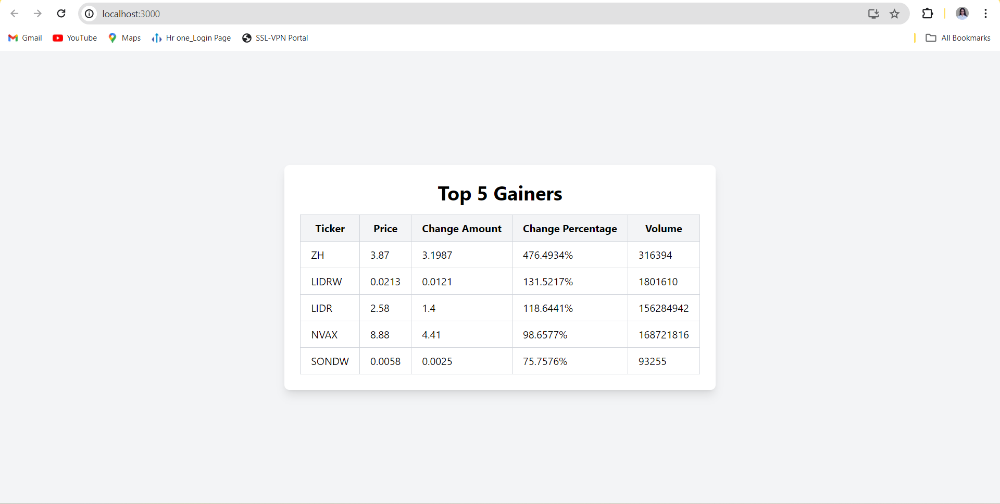

# K-C-Investment


K-C Investment is a web application that displays information about the top gainers in the stock market.

## Installation

1. Clone the repository:
   ```bash
   git clone https://github.com/Sonali020200/K-C-Investment.git

   cd K-C-Investment

   cd client

   npm install

   npm start
```

## Usage

The application automatically fetches data about the top gainers from the Alpha Vantage API. 
Users can view the top 5 gainers and their relevant information, such as ticker symbol, 
price, change amount, change percentage, and volume.

## Preview




